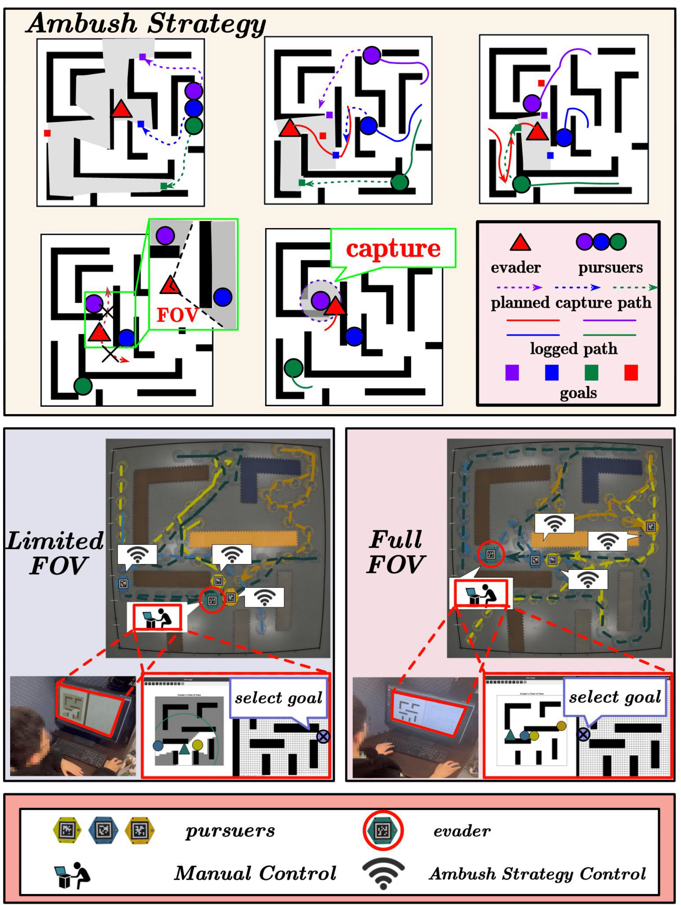
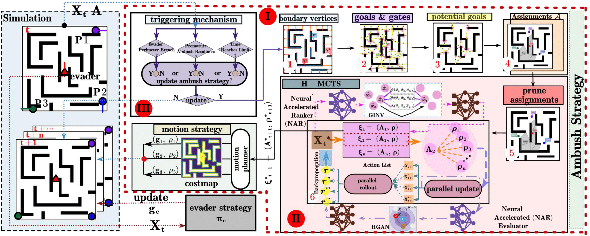

# 🚀 **[AMBUSH]**  

🌟 **Coming Soon!** 🌟  

We're thrilled to announce our upcoming project, **AMBUSH**! Stay tuned for cutting-edge innovations, powerful features, and a transformative open-source experience.

---

## 🔥 What is AMBUSH?
 Collaborative capture of dynamic targets is common
 in nature as an essential strategy for weaker
 species against the strong.
 Similar concepts have shown to be useful for numerous
 robotic applications, such as security and surveillance,
 search and rescue.
 However, most existing works focus on analytical and geometric solutions or
 end-to-end reinforcement learning methods,
 which are largely constrained to obstacle-free environments or
 scenarios with sparse, regularly distributed obstacles.
 This work tackles the problem from a unique perspective:
 the renowned strategy of ``ambush'' alone would suffice
 for multiple slower pursuers to capture one
 faster evader with different levels of intelligence
 efficiently in complex environments.
 A parameterized strategy of ambush (including discrete
 and continuous parameters) is designed first,
 which takes into account the topological properties of the workspace,
 the truncated line-of-sight visibility,
 the relative speed ratio and the limited capture range.
 Then, a Hybrid Monte Carlo Tree Search (H-MCTS) algorithm is proposed
 to optimize the associated parameters through long-term planning,
 enabling the identification of highly promising parameters for future capture.
 Lastly, the strategy is trained offline to learn
 the ranking of different choices of parameters across various environments,
 and to directly predict scores,
 replacing the rollout process in H-MCTS.
 The learned heuristics are adopted during online H-MCTS to accelerate
 the planning procedure while guaranteeing the planning quality.
 Its efficiency and effectiveness are validated in extensive simulations
 and hardware experiments,
 against the different capability and intelligence of the evaders,
 including  two-times higher velocity and human-controlled behavior.

---

## 📅 **Coming Soon!**

The wait is almost over! This repository will soon be populated with:  
- 📂 Source code  
- 📖 Documentation  
- 🚀 Setup instructions  
- 💡 Tutorials  

---

## 🌐 Check Out the Website!  

Stay in the loop by visiting our official website:  
👉 **[Our Project Website](https://github.com/JunfengChen-robotics/AMBUSH)**  

---

## 📢 **Why Follow Us?**  

- 🔬 Cutting-edge innovation in multi-robot coordination under limited communication.  
- 📚 Comprehensive, developer-friendly resources.  
- 🌎 Open-source contributions that make a difference.

---

## 📌 Stay Updated!  

- ⭐ Star this repository to be notified when it launches!  
- 🔗 Bookmark our website for updates.  

---

## 👥 **Maintainers**

- [**Junfeng Chen**](mailto:chenjunfeng@stu.pku.edu.cn)  
- [**Yinhang Luo**](mailto:Inhang0618@alumni.pku.edu.cn)  
- [**Junrui Li**](mailto:leejunrui@stu.pku.edu.cn)  
- [**Meng Guo**](mailto:meng.guo@pku.edu.cn)  

For any inquiries or contributions, feel free to contact us! 🚀

